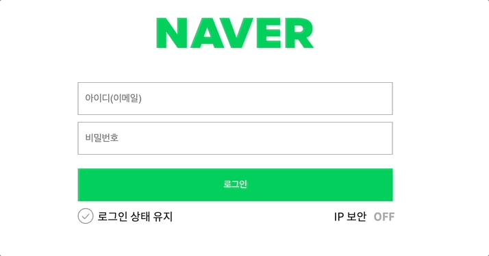
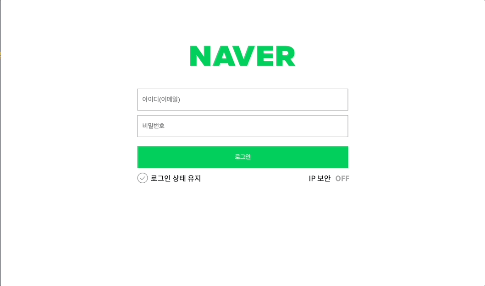
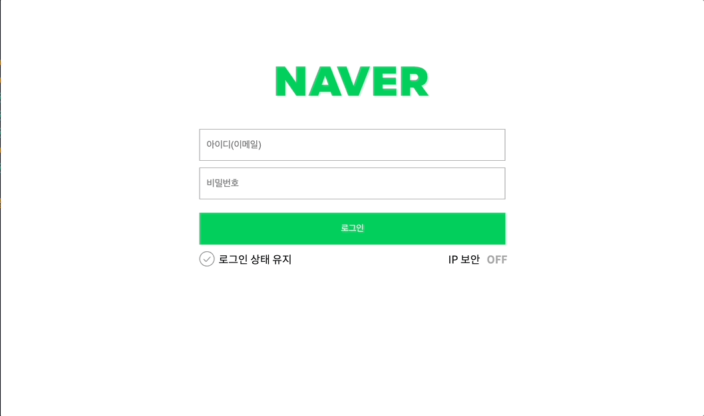

# 네이버 로그인 페이지 구현

|id validation(O)|pw validation(O)|
|------|---|
|||

```js
// 이메일/비밀번호 입력값이 모두 유효할 때만 버튼 활성화
function handleLogin(e) {
  e.preventDefault();
  // 이메일 입력조건과 비밀번호 입력조건중  둘다 만족한 경우 로그인 성공
  emailReg(email.value) && pwReg(pw.value)
    ? userLogin()
    : console.log("로그인 실패");
}
```


---

|지정된 id,pw validation(O)|실패인 경우|
|------|------|
|||

로그인과 비밀번호를 정확히 입력했을 때 welcome 페이지로 넘어갈 수 있도록 코드 로직을 작성합니다.

```js
function userLogin() {
  email.value === user.id && pw.value === user.pw
    ? (window.location.href = "welcome.html")
    : alert("user님의 로그인이 실패했습니다.");
}
```

---
- [x] 재사용 가능한 함수를 분리하고 함수를 중심으로 설계하는 방법에 대해 학습합니다.


