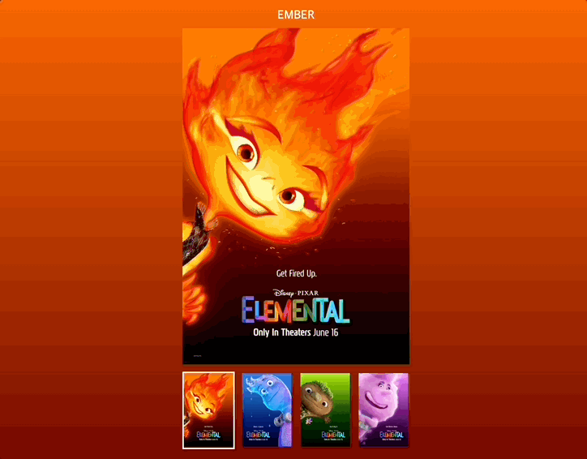

# li 에 클릭 이벤트 추가 리스트
1. 작은 포스터 이미지를 클릭하면 해당 포스터에 보더 효과가 적용 됨
```js
if (!li) return;
  let index = li.dataset.index;

  list.forEach((li) => {
    li.classList.remove("is-active");
  });
  li.classList.add("is-active");
```
2. 클릭한 해당포스터의 이미지와 배경색, 타이틀 글자가 바뀜

```js
//이미지와 글자 변경
  visualImage.alt = data[index - 1].alt;
  visualImage.src = `./assets/${data[index - 1].name.toLowerCase()}.jpeg`;
  Letter.textContent = data[index - 1].name;

  //배경색 변경
  const color1 = data[index - 1].color[0];
  const color2 = data[index - 1].color[1];
  document.body.style.backgroundImage = `linear-gradient(to bottom right, ${color1}, ${color2})`;

```
3. 각 캐릭터의 오디오가 재생 됨 

```js
//오디오 재생 추가
  let audios = new Audio(
    `./assets/audio/${data[index - 1].name.toLowerCase()}.m4a`
  );
  audios.loop = false; // 반복재생하지 않음
  audios.volume = 0.3; // 음량 설정
  audios.play(); // sound1.mp3 재생
```


## 완성된 페이지 gif

